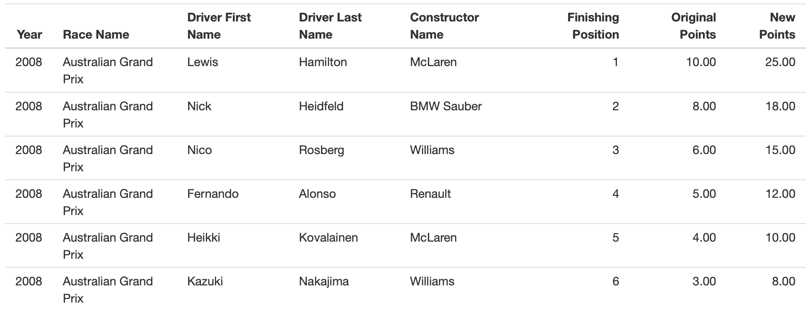
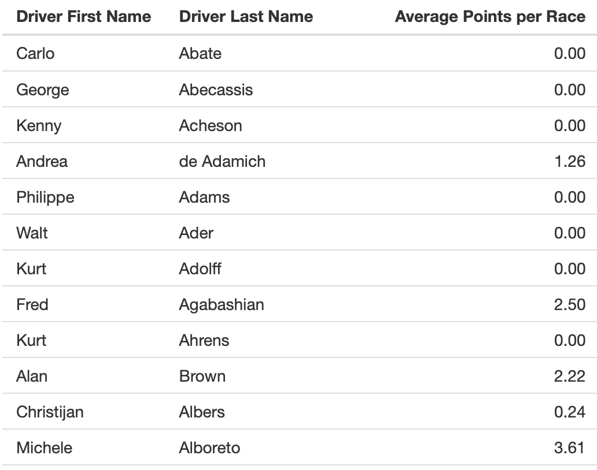
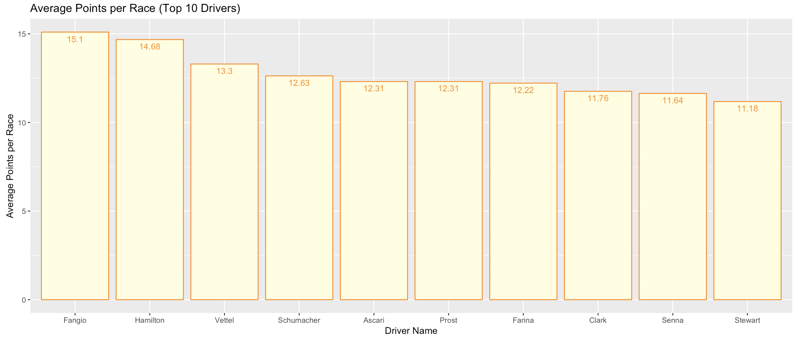

```{r set-options, include = FALSE}
# Sets default chunk options
knitr::opts_chunk$set(
  # Figures/Images will be centered
  fig.align = "center", 
  # Code will not be displayed unless `echo = TRUE` is set for a chunk
  echo = FALSE,
  # Messages are suppressed
  message = FALSE,
  # Warnings are suppressed
  warning = FALSE
)
```

```{r install-and-load-packages, include = FALSE}
# All packages needed should be loaded in this chunk
pkg_list = c('knitr', 'kableExtra', 'magrittr')

# Determine what packages are NOT installed already.
to_install_pkgs = pkg_list[!(pkg_list %in% installed.packages()[,"Package"])]

# Install the missing packages
if(length(to_install_pkgs)) {
  install.packages(to_install_pkgs, repos = "https://cloud.r-project.org")
}

# Load all packages
sapply(pkg_list, require, character.only = TRUE)
```

<!-- Force a new page -->
\newpage

# Introduction

Evidence for Rule Changes and Evolution of Formula One:

The regulating body of Formula One, the Federation Internationale de L’Automobile (FIA), changes several regulations for the sport on a year-to-year basis. This has resulted in several changes to how Formula One cars perform. The specific differences in [regulation are published by the FIA every year](https://www.fia.com/regulation/category/110).  We can also see the differences in regulation by simply looking at [how a Formula One car from 1950 compares to one from today](https://www.wired.com/2017/03/formula-one-f1-race-car-evolution/).

These regulations have also changed how the points for a race are allocated. This can be seen by looking at Point Scoring Systems table in the appendix [Figure 1 in Appendix]. If the current points system was in place throughout the years it may have resulted in different drivers and teams winning championships. Different years also had a different number of  teams participating in the sport which changed how hard it is to score points (if there are fewer teams participating it is easier to achieve a points scoring position).

Addressing the Problem:

As stated above, the problem created by all of these changes in the sport is that it is hard to compare the drivers and teams in the sport over the years from the ones today. To address this problem we normalized the results of races over the 68 years as accurately as possible. The results were normalized by taking into consideration changes in the sport. For example, we used the race results data and apply the current points system to it. Then we determined which drivers and teams would have won the championships with the current points system applied.

Formula One fans (who are the target audience of this project) would interested in these results because they will be able to better compare teams and drivers who have participated in the sport. 

Data:

The data for this project is from the [‘Ergast Database’](https://ergast.com/mrd/db/). The database contains 13 datasets with information on different aspects of Formula One (e.g. race results, lap times, qualifying results, driver information). Most of these datasets have several hundreds of observations. These datasets were merged and analyzed as needed to normalize the data over 1950 to 2017. Refer to the ‘Methods’ section below to see how the data was processed to achieve the results we need. The variables present in each dataset have been specified in Figure 2 of the Appendix. A small subset of all of the datasets have been shown in Figure 3 of the Appendix.


Relation to STAT 385:

This idea matches with this course’s focus on statistical programming because we are manipulating several datasets and extracting information from them.

  

# Related Work

  As stated previously in our introduction, Formula One racing has grown immensely in the last 68 seasons, making it an extremely interesting topic to analyze. After some further research into our topic, we found a few interesting sources that are related to what we were trying to accomplish. Although we were able to find sources to help us gain further knowledge into our topic, we were not able to find any research that had the same goal as our project. As Formula One racing grows in popularity, more and more research is being conducted on the efficiency of cars and creating models to decrease lap times. Our project, however, largely focuses on normalizing race results over the past 68 seasons in order compare results and see how Formula One races have evolved over time on a deeper level.
  
  We first looked at [Simulating Formula One Race Strategies](https://beta.vu.nl/nl/Images/werkstuk-sulsters_tcm235-877826.pdf), conducted by Claudia Sulsters from the Vrije University in Amsterdam. The goal of her research was to create a simulation model that could be used by Formula One drivers to enhance their performance. By using her model, racers are able to simulate different race strategies to determine how these strategies will affect their result. In Sulster’s research, she used data from four races in the 2016 season. While Sulsters work is extremely interesting and useful to racers, it does not take into account the ever changing rules and regulations of the sport. She uses only data from 2016 and since the engineering of the cars, point systems and other rules will change, her model will eventually become out of date in the coming years. For our project, we will standardize the results in order to compare every year starting from 1950 when the sport became official. 
  
  In addition to Sulter’s research, we also found [Formula 1 Race Car Performance Improvement by Optimization of the Aerodynamic Relationship Between the Front and Rear Wings](https://etda.libraries.psu.edu/files/final_submissions/9695) by Unmukt Rajeev Bhatnagar, a graduate student in aerospace engineering at Pennsylvania State University. The research done by Bhatnagar is relevant to our project since he looks at how the design of cars has changed within the 27 seasons. His main goal is to create a vehicle that is more aerodynamic to decrease lap times. In relation to this research conducted by Bhatnagar, our project is vastly different as we do not aim to create a more efficient car, but to analyze previous efficiencies by normalizing results for better comparison.
  
  The last source that we found, [InfoZoom - Analysing Formula One racing results with an interactive data mining and visualisation tool](file:///Users/emmaplansky/Downloads/DATA00044FU.pdf), is a report on a visualization tool used for Formula 1 racing. This interactive data analysis tool is called InfoZoom. The paper was written by Michael Spenke and Christian Beilken from the German National Research Center for Information Technology. The tool was created to explore the statistics of each individual driver. The information that is available from this tool only includes the years 1978 to 1998. The tool displays pictures of the drivers, information on what type of car the driver was most successful with, and other race statistics for each specific driver. The goal of this visualization is to make the user more comfortable with the data, however, it does not dive deep into analyzing the data that is displayed. 
  
  The idea that our team has come up with is very useful for Formula One enthusiasts as we aimed to make comparisons for the 68 seasons available to those who are interested. Due to the large amounts of data that has been collected for Formula One, there is a lot of research that has been conducted. However, our project brings in another element to the analysis which has not been looked at before.


# Methods

The goals of the project discussed in the ‘Introduction’ were achieved by completing the following steps:

Reading the data into R:

To begin our project, we first had to read the data, which were all CSV files, into R. We started with a total of 14 datasets which were uploaded using the function read.csv(). After uploading the data, we then moved on to data cleaning.

Data Cleaning: 

The first step we took in cleaning the data was adding variable names to the columns and all 14 tables. After those were added, we started looking at the levels within each of the variables. As our data was pretty clean to begin with, the only further cleaning that needed to be done was merging certain datasets as required for each of the visuals. This was completed throughout the project as the visuals were created.

Data Visualizations:

In order to create the table visualizations seen in our Shiny application, we used dplyr join functions to merge together the different tables. In this process we also used the 'subset' function to drop any unnecessary variables that were not needed in our final tables. 

In our Shiny application, we also wanted to include barplots and other graphs in order to better display what can be seen in the tables. To create these visuals, we used ggplot2, a package created by Hadley Wickham.

Presenting the data:

As mentioned above we created a Shiny application, which was obviously created using the shiny package.


# Results

The important tables and visuals from our project can be found in the shiny application itself. Below are some examples of these important tables (only the first few observations are shown):

New Points Table







\newpage

# Discussion

The overall purpose of our project was to compare drivers and teams in Formala One across the different eras of the sport. In order to achieve our outcome, a variety of variables were analyzed to determine whether or not they would be appropriate for the comparison of drivers and teams. 

As mentioned above, one of the ways that we compared drivers/teams in Formula One is by normalizing the number of points that were earned to the modern point system. The purpose of this is so that Formula One enthusiasts can compare their favorite drivers from previous eras of the sport to current divers.

From this analysis and the visuals we created we were able to determine that teams like Ferrari, McLaren, Williams and Mercedes have been dominant in Formula One. Drivers like Schumacher, Vettel, Alonso and Hamilton also appear regularly as some of the top drivers to have raced in the sport.

# Conclusion

Formula One has evolved and grown tremendously as a sport over the last several decades. As a result of its growth, over the total 68 seasons, the rules and regulations have changed with almost every passing year. We strived to make interactive visuals that show the evolution of the sport and compare the results of these races in a normalized manner. For those who enjoy watching Formula One and seeing how the cars and drivers have changed, this project gives them an opportunity to accurately make comparisons over the years. 

Our Shiny Application provides enthusiasts with a chance to compare their favorite drivers and teams through an interactive model. For further information on how our application can be utilized, our demo video will provide a clear explanation.


\newpage

# Appendix

**Figure 1**

| Seasons    | 1st | 2nd | 3rd | 4th | 5th | 6th | 7th | 8th | 9th | 10th | Fastest Lap | Best Results Counted Towards Drivers' Championship | Best Results Counted Towards Constructors' Championship
|-------------|:----------:|:--:|:--:|:--:|:--:|:--:|:--:|:--:|:--:|:--:|:--:|:---------------------------------:|:---------------------------------:|
| **1950-1953** | 8 | 6 | 4 | 3 | 2 |  |  |  |  |  | 1 | 4 | NA | 
| **1954** | 8 | 6 | 4 | 3 | 2 |  |  |  |  |  | 1 | 5 | NA | 
| **1955** | 8 | 6 | 4 | 3 | 2 |  |  |  |  |  | 1 | 5 | NA|
| **1956-1957** | 8 | 6 | 4 | 3 | 2 |  |  |  |  |  | 1 | 5 | NA | 
| **1958** | 8 | 6 | 4 | 3 | 2 |  |  |  |  |  | 1 | 6 | 6 | 
| **1959**  | 8 | 6 | 4 | 3 | 2 |  |  |  |  |  | 1 | 5 | 5 |
| **1960** | 8 | 6 | 4 | 3 | 2 | 1 |  |  |  |  |  | 6 | 6 |
| **1961** | 9 (D) 8 (C) | 6 | 4 | 3 | 2 | 1 |  |  |  |  |  | 5 | 5 |
| **1962** | 9 | 6 | 4 | 3 | 2 | 1 |  |  |  |  |  | 5 | 5 |
| **1963-1965** | 9 | 6 | 4 | 3 | 2 | 1 |  |  |  |  |  | 6 | 6 | 
| **1966** | 9 | 6 | 4 | 3 | 2 | 1 |  |  |  |  |  | 5 | 5 | 
| **1967**  | 9 | 6 | 4 | 3 | 2 | 1 |  |  |  |  |  | 9 (5 from first 6, 4 from last 5) | 9 (5 from first 6, 4 from last 5) |
| **1968** | 9 | 6 | 4 | 3 | 2 | 1 |  |  |  |  |  | 10 (5 from first 6, 5 from last 6) | 10 (5 from first 6, 5 from last 6) |
| **1969** | 9 | 6 | 4 | 3 | 2 | 1 |  |  |  |  |  | 9 (5 from first 6, 4 from last 5) | 9 (5 from first 6, 4 from last 5) |
| **1970** | 9 | 6 | 4 | 3 | 2 | 1 |  |  |  |  |  | 11 (6 from first 7, 5 from last 6) | 11 (6 from first 7, 5 from last 6) |
| **1971** | 9 | 6 | 4 | 3 | 2 | 1 |  |  |  |  |  | 9 (5 from first 6, 4 from last 5) | 9 (5 from first 6, 4 from last 5) |
| **1972** | 9 | 6 | 4 | 3 | 2 | 1 |  |  |  |  |  | 10 (5 from first 6, 5 from last 6) | 10 (5 from first 6, 5 from last 6) |
| **1973-1974**  | 9 | 6 | 4 | 3 | 2 | 1 |  |  |  |  |  | 13 (7 from first 8, 6 from last 7) | 13 (7 from first 8, 6 from last 7)
| **1975** | 9 | 6 | 4 | 3 | 2 | 1 |  |  |  |  |  | 12 (6 from first 7, 6 from last 7) | 12 (6 from first 7, 6 from last 7) |
| **1976** | 9 | 6 | 4 | 3 | 2 | 1 |  |  |  |  |  | 14 (7 from first 8, 6 from last 7) | 14 (7 from first 8, 6 from last 7) |
| **1977** | 9 | 6 | 4 | 3 | 2 | 1 |  |  |  |  |  | 15 (8 from first 9, 7 from last 8) | 15 (8 from first 9, 7 from last 8) |
| **1978** | 9 | 6 | 4 | 3 | 2 | 1 |  |  |  |  |  | 14 (7 from first 8, 7 from last 8) | 14 (7 from first 8, 7 from last 8) |
| **1979** | 9 | 6 | 4 | 3 | 2 | 1 |  |  |  |  |  | 8 (4 from first 7, 4 from last 8) | All |
| **1980**  | 9 | 6 | 4 | 3 | 2 | 1 |  |  |  |  |  | 10 (5 from first 7, 5 from last 7) | All |
| **1981-1990** | 9 | 6 | 4 | 3 | 2 | 1 |  |  |  |  |  | 11 | All |
| **1991-2002** | 10 | 6 | 4 | 3 | 2 | 1 |  |  |  |  |  | All | All |
| **2003-2009** | 10 | 6 | 4 | 3 | 2 | 1 |  |  |  |  |  | All | All|
| **2010-present** | 25 | 18 | 15 | 12 | 10 | 8 | 6 | 4 | 2 | 1 |  | All | All |


\newpage


| Tables in Formula 1 Database |
|:--------------------:|
| circuits             |
| constructorResults   |
| constructorStandings |
| constructors         |
| driverStandings      |
| drivers              |
| lapTimes             |
| pitStops             |
| qualifying           |
| races                |
| results              |
| seasons              |
| status               |

10 observations from each table as examples:
```{r}
circ_raw = read.csv('proposal/circuits.csv', header = FALSE)
colnames(circ_raw) = c('circuitId', 'circuitRef', 'name', 'location', 'country', 'lat', 'lng', 'alt', 'url')

constResu_raw = read.csv('proposal/constructor_results.csv', header = FALSE)
colnames(constResu_raw) = c('constructorResultsId', 'raceId', 'constructorId', 'points', 'status')

constStan_raw = read.csv('proposal/constructor_standings.csv', header = FALSE)
colnames(constStan_raw) = c('constructorStandingsId', 'raceId', 'constructorId', 'points', 'position', 'positionText', 'wins')

const_raw = read.csv('proposal/constructors.csv', header = FALSE)
colnames(const_raw) = c('constructorId', 'constructorRef', 'name', 'nationality', 'url')

drivStan_raw = read.csv('proposal/driver_standings.csv', header = FALSE)
colnames(drivStan_raw) = c('driverStandingsId', 'raceId', 'driverId', 'points', 'positionText', 'wins')

driv_raw = read.csv('proposal/driver.csv', header = FALSE)
colnames(driv_raw) = c('driverId', 'driverRef', 'number', 'code', 'forename', 'surname', 'dob', 'nationality', 'url')

lapTime_raw = read.csv('proposal/lap_times.csv', header = FALSE)
colnames(lapTime_raw) = c('raceId', 'driverId', 'lap', 'position', 'time', 'milliseconds')

pitStop_raw = read.csv('proposal/pit_stops.csv', header = FALSE)
colnames(pitStop_raw) = c('raceId', 'driverId', 'stop', 'lap', 'time', 'duration', 'milliseconds')

qual_raw = read.csv('proposal/qualifying.csv', header = FALSE)
colnames(qual_raw) = c('qualifyId', 'raceId', 'driverId', 'constructorId', 'number', 'position', 'q1', 'q2', 'q3')

race_raw = read.csv('proposal/races.csv', header = FALSE)
colnames(race_raw) = c('raceId', 'year', 'round', 'circuitId', 'name', 'date', 'time', 'url')

resu_raw = read.csv('proposal/results.csv', header = FALSE)
colnames(resu_raw) = c('resultId', 'raceId', 'driverId', 'constructorId', 'number', 'grid', 'position', 'positionText', 'positionOrder', 'points', 'laps', 'time', 'milliseconds', 'fastestLap', 'rank', 'fastestLapTime', 'fastestLapSpeed', 'statusId')

seas_raw = read.csv('proposal/seasons.csv', header = FALSE)
colnames(seas_raw) = c('year', 'url')

stat_raw = read.csv('proposal/status.csv', header = FALSE)
colnames(stat_raw) = c('statusId', 'status')

kable(circ_raw[1:10 ,], caption="Circuit Data")
kable(constResu_raw[1:10 ,], caption="Constructor Results Data")
kable(constStan_raw[1:10 ,], caption="Constructor Standings Data")
kable(const_raw[1:10 ,], caption="Constructors Data")
kable(drivStan_raw[1:10 ,], caption="Driver Standing Data")
kable(driv_raw[1:10 ,], caption="Driver Data")
kable(lapTime_raw[1:10 ,], caption="Lap Times Data")
kable(pitStop_raw[1:10 ,], caption="Pit Stops Data")
kable(qual_raw[1:10 ,], caption="Qualifying Data")
kable(race_raw[1:10 ,], caption="Race Data")
kable(resu_raw[1:10 ,], caption="Result Data")
kable(seas_raw[1:10 ,], caption="Season Data")
kable(stat_raw[1:10 ,], caption="Status Data")
```


\newpage


# References
@dplyr2018
@allaire2015rmarkdown
@wickham2014tidy
@sulsters2018simulating
@bhatnagar2014formula
@spenke2000infozoom
@wickham2018ggplot2
@stewart2018
@fia
@davies_masters2016


<!-- Remove the newpage break when the above text is no longer useful -->
\newpage
