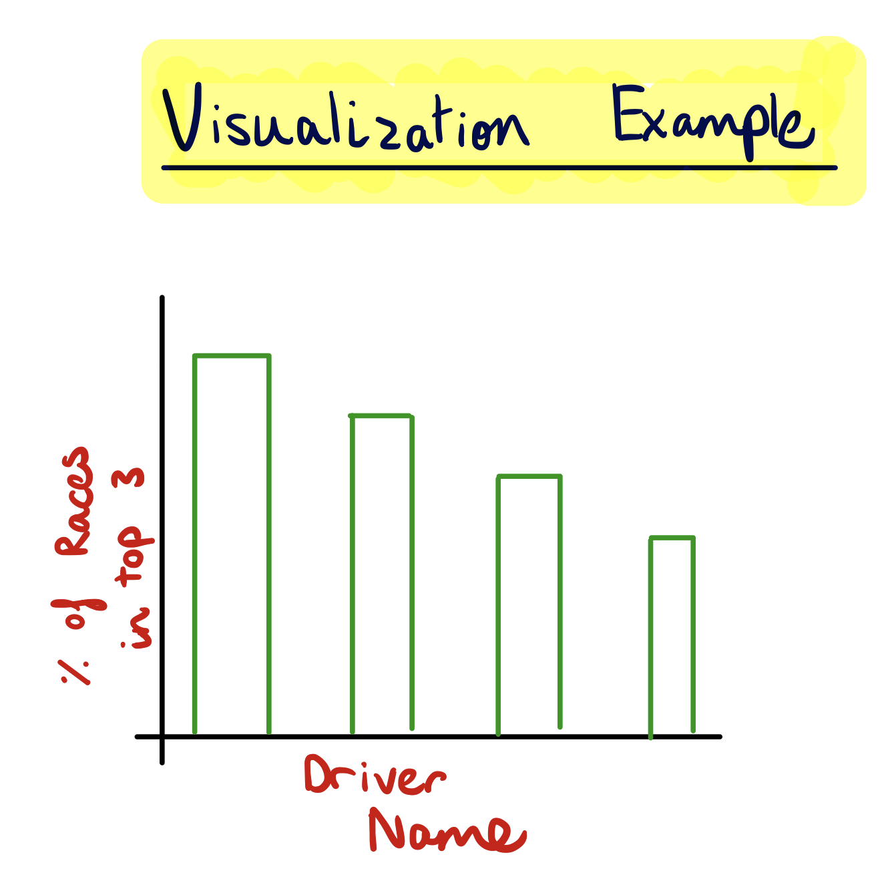
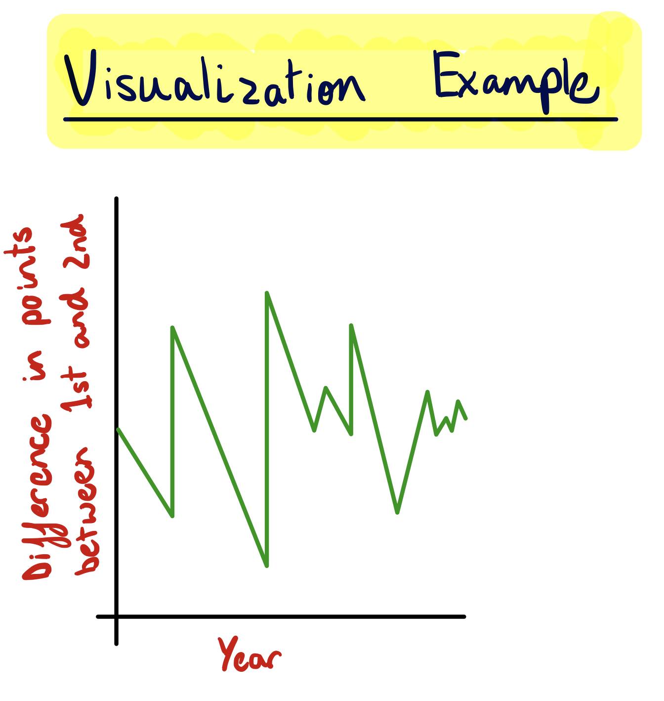
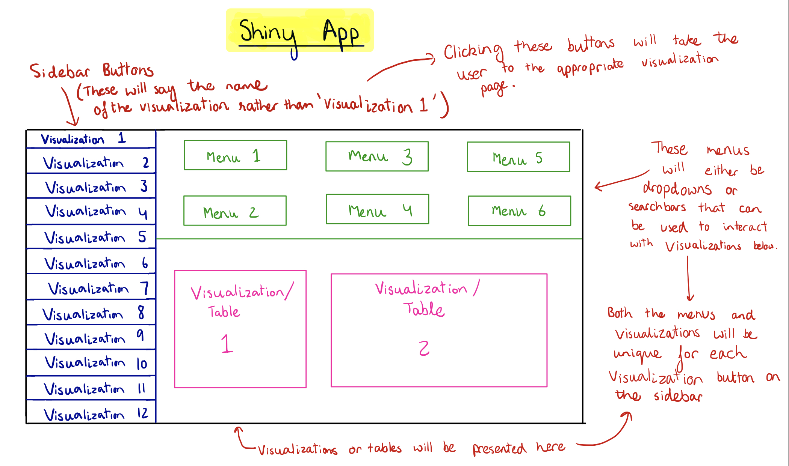

```{r set-options, include = FALSE}
# Sets default chunk options
knitr::opts_chunk$set(
  # Figures/Images will be centered
  fig.align = "center", 
  # Code will not be displayed unless `echo = TRUE` is set for a chunk
  echo = FALSE,
  # Messages are suppressed
  message = FALSE,
  # Warnings are suppressed
  warning = FALSE
)
```

```{r install-and-load-packages, include = FALSE}
# All packages needed should be loaded in this chunk
pkg_list = c('knitr', 'kableExtra', 'magrittr')

# Determine what packages are NOT installed already.
to_install_pkgs = pkg_list[!(pkg_list %in% installed.packages()[,"Package"])]

# Install the missing packages
if(length(to_install_pkgs)) {
  install.packages(to_install_pkgs, repos = "https://cloud.r-project.org")
}

# Load all packages
sapply(pkg_list, require, character.only = TRUE)
```

<!-- Force a new page -->
\newpage

# Introduction

**Evidence for Rule Changes and Evolution of Formula One**

The regulating body of Formula One, the Federation Internationale de L’Automobile (FIA), changes several regulations for the sport on a year-to-year basis. This has resulted in several changes to how Formula One cars perform. The specific differences in [***regulation are published by the FIA every year***](https://www.fia.com/regulation/category/110).  We can also see the differences in regulation by simply looking at [***how a Formula One car from 1950 compares to one from today***](https://www.wired.com/2017/03/formula-one-f1-race-car-evolution/).

These regulations have also changed how the points for a race are allocated. This can be seen by looking at Point Scoring Systems table in the appendix [Table 1 in Appendix]. If the current points system was in place throughout the years it may have resulted in different drivers and teams winning championships. Different years also had a different number of  teams participating in the sport which changed how hard it is to score points (if there are fewer teams participating it is easier to achieve a points scoring position).

Safety regulations have also drastically changed over the years which has resulted in a large reduction in the number of fatalities and injuries in the sport. The [***death of Jules Bianchi***](https://www.cnn.com/2016/07/14/motorsport/jules-bianchi-death-anniversary-formula-one/index.html) in 2014 season, a driver for the Marussia F1 Team, was the first fatality in the sport in over 2 decades. However, in the 1950s it was common for several fatalities to occur in a single season.

**Addressing the Problem**

As stated above, the problem created by all of these changes in the sport is that it is hard to compare the drivers and teams in the sport over the years from the ones today. To address this problem we will normalize the results of races over the 68 years as accurately as possible. The results will be normalized by taking into consideration changes in factors like points systems, number of races per season, tracks used in a season and other regulations. For example, we can use the race results data and apply the current points system to it. Then we can determine which drivers and teams would have won the championships with the current points system applied.

**Data**

The data for this project is from the [***Ergast Database***](https://ergast.com/mrd/db/). The database contains 13 datasets with information on different aspects of Formula One (e.g. race results, lap times, qualifying results, driver information). Most of these datasets have several hundreds of observations. These datasets will be merged and analyzed as needed to normalize the data over 1950 to 2017. Refer to the ‘Methods’ section below to see how the data will be processed to achieve the results we need. A small subset of some of the datasets have been shown in Tables 2 & 3 of the Appendix. The variables present in each dataset have been specified in Tables 4 - 17 of the Appendix.


**Relation to STAT 385**

This idea matches with this course’s focus on statistical programming because we are manipulating several datasets and extracting information from them.

\newpage

# Related Work

  As stated previously in our introduction, Formula One racing has grown immensely in the last 68 seasons, making it an extremely interesting topic to analyze. After some further research into our topic, we found a few interesting sources that are related to what we are trying to accomplish. Although we were able to find sources to help us gain further knowledge into our topic, we were not able to find any research that had the same goal as our project. As Formula One racing grows in popularity, more and more research is being conducted on the efficiency of cars and creating models to decrease lap times. Our project, however, largely focuses on normalizing race results over the past 68 seasons in order compare results and see how Formula One races have evolved over time on a deeper level.
  
  We first looked at [***Simulating Formula One Race Strategies***](https://beta.vu.nl/nl/Images/werkstuk-sulsters_tcm235-877826.pdf), conducted by Claudia Sulsters from the Vrije University in Amsterdam. The goal of her research was to create a simulation model that could be used by Formula One drivers to enhance their performance. By using her model, racers are able to simulate different race strategies to determine how these strategies will affect their result. In Sulster’s research, she used data from four races in the 2016 season. While Sulsters work is extremely interesting and useful to racers, it does not take into account the ever changing rules and regulations of the sport. She uses only data from 2016 and since the engineering of the cars, point systems and other rules will change, her model will eventually become out of date in the coming years. For our project, we will standardize the results in order to compare every year starting from 1950 when the sport became official. 
  
  In addition to Sulter’s research, we also found [***Formula 1 Race Car Performance Improvement by Optimization of the Aerodynamic Relationship Between the Front and Rear Wings***](https://etda.libraries.psu.edu/files/final_submissions/9695) by Unmukt Rajeev Bhatnagar, a graduate student in aerospace engineering at Pennsylvania State University. The research done by Bhatnagar is relevant to our project since he looks at how the design of cars has changed within the 27 seasons. His main goal is to create a vehicle that is more aerodynamic to decrease lap times. In relation to this research conducted by Bhatnagar, our project is vastly different as we do not aim to create a more efficient car, but to analyze previous efficiencies by normalizing results for better comparison.
  
  The last source that we found, [***InfoZoom - Analysing Formula One racing results with an interactive data mining and visualisation tool***](file:///Users/emmaplansky/Downloads/DATA00044FU.pdf), is a report on a visualization tool used for Formula 1 racing. This interactive data analysis tool is called InfoZoom. The paper was written by Michael Spenke and Christian Beilken from the German National Research Center for Information Technology. The tool was created to explore the statistics of each individual driver. The information that is available from this tool only includes the years 1978 to 1998. The tool displays pictures of the drivers, information on what type of car the driver was most successful with, and other race statistics for each specific driver. The goal of this visualization is to make the user more comfortable with the data, however, it does not dive deep into analyzing the data that is displayed. 
  
  The idea that our team has come up with will be very useful for Formula One enthusiasts as we aim to make comparisons for the 68 seasons available to those who are interested. Due to the large amounts of data that has been collected for Formula One, there is a lot of research that has been conducted. However, our project will bring in another element to the analysis which has not been looked at before.

\newpage

# Methods

The goals of the project discussed in the ‘Introduction’ section will be achieved by completing the following steps:

**Reading the data into R:**

This datasets we will be using are currently saved as CSV files. Thus, these can be read in by simply using the read.table() function.

**Data Cleaning and Merging:** 

These data transformations will be done by first merging the datasets as needed using merge() and rbind() functions. Then to clean and summarize the data further we will use tidyr and dplyr packages.

**Data Visualizations:**

To form visualizations from this cleaned data we will use the ggplot2, plotly and gganimate packages. Some examples of these visualizations have been shown in Figures 1 & 2 in the Appendix.

**Forming visualizations into a Shiny app:**

These visualizations will then be compiled into a single Shiny app. A rough sketch for this app is present in Figure 3 of the Appendix. The visualizations will be supported by tables with our data where deemed necessary.

**Current Progress:**

We have done research on what the variables in each of the datasets mean in order to better understand what information we can extract from our data and what the limitations of the data are. We have also read in the data to R.


```
Figure \@ref(fig:code-chunk-name-here).
```
\newpage

# Feasibility

We should have no problem completing this project by the deadline of December 18th. Over the next three weeks, we will be working hard to accomplish our goals and complete a quality final deliverable. Below is an outline of how our team will work to accomplish our goal in a timely manner.

**Week 1: Nov. 26-Dec. 2**

1. Merging
    a. Emma/Sid
        - Deadline: Wednesday, Nov. 28 by midnight
1. Cleaning
    a. Alex/Waseem
        - Deadline: Saturday, Dec. 1 by midnight
1. Main Group Meeting
    a. All members
        - On Sunday, Dec. 2 at 6pm, review what we have done and prepare for following week
        - NOTE: This is in addition to smaller meetings throughout the week

**Week 2: Dec. 3-Dec. 9**

1. Data Visualizations
    a. Waseem/Emma
        - Deadline: Thursday, Dec. 6 at midnight
1. Start Shiny App
    a. Sid/Alex
        - Deadline: Tuesday, Dec. 11 at midnight
1. Main Group Meeting
    a. All members
        - On Sunday, Dec. 9 at 6pm, review what we have done and prepare for following week
        - NOTE: This is in addition to smaller meetings throughout the week

**Week 3: Dec.10-Dec.16**

1. Finish Shiny App
    a. All members
        - Deadline: Tuesday, Dec. 11 at midnight
1. Demo Video
    a. Sid/Emma
        - Deadline: Friday, Dec. 14 at midnight
1. Start Report
    a. Alex/Waseem
        - Deadline: 3/4 of report on Saturday, Dec. 15 at Midnight
1. Main Group Meeting
    a. All members
        - On Sunday, Dec. 16 at 6pm, review what we have done and prepare for following week
        - NOTE: This is in addition to smaller meetings throughout the week
        

**Final Two Days**

1. Finish Report
    a. All members
        - Deadline: Sunday, Dec. 16 at midnight
1. Final Touches
    a. All members
        - Deadline: Tuesday, Dec. 18 at 10pm


\newpage

# Conclusion

Formula One has evolved and grown tremendously as a sport over the last several decades. As a result of its growth, over the total 68 seasons, the rules and regulations have changed with almost every passing year. What we are striving to do with our project is make interactive visuals that will show the evolution of the sport and compare the results of these races in a normalized manner. For those who enjoy watching Formula One and seeing how the cars and drivers have changed, this project will give them an opportunity to accurately make comparisons over the years. 


\newpage

# Appendix

Table 1: Points System Table

_There have been years where the fastest lap of the race counted in points and only a particular number of the best races by a driver have counted towards the final results of a season. This is no longer the case as be seen by the points system from 2010 onwards._

| Seasons    | 1st | 2nd | 3rd | 4th | 5th | 6th | 7th | 8th | 9th | 10th | Fastest Lap | Best Results Counted Towards Drivers' Championship | Best Results Counted Towards Constructors' Championship
|-------------|:----------:|:--:|:--:|:--:|:--:|:--:|:--:|:--:|:--:|:--:|:--:|:---------------------------------:|:---------------------------------:|
| **1950-1953** | 8 | 6 | 4 | 3 | 2 |  |  |  |  |  | 1 | 4 | NA | 
| **1954** | 8 | 6 | 4 | 3 | 2 |  |  |  |  |  | 1 | 5 | NA | 
| **1955** | 8 | 6 | 4 | 3 | 2 |  |  |  |  |  | 1 | 5 | NA|
| **1956-1957** | 8 | 6 | 4 | 3 | 2 |  |  |  |  |  | 1 | 5 | NA | 
| **1958** | 8 | 6 | 4 | 3 | 2 |  |  |  |  |  | 1 | 6 | 6 | 
| **1959**  | 8 | 6 | 4 | 3 | 2 |  |  |  |  |  | 1 | 5 | 5 |
| **1960** | 8 | 6 | 4 | 3 | 2 | 1 |  |  |  |  |  | 6 | 6 |
| **1961** | 9 (D) 8 (C) | 6 | 4 | 3 | 2 | 1 |  |  |  |  |  | 5 | 5 |
| **1962** | 9 | 6 | 4 | 3 | 2 | 1 |  |  |  |  |  | 5 | 5 |
| **1963-1965** | 9 | 6 | 4 | 3 | 2 | 1 |  |  |  |  |  | 6 | 6 | 
| **1966** | 9 | 6 | 4 | 3 | 2 | 1 |  |  |  |  |  | 5 | 5 | 
| **1967**  | 9 | 6 | 4 | 3 | 2 | 1 |  |  |  |  |  | 9 (5 from first 6, 4 from last 5) | 9 (5 from first 6, 4 from last 5) |
| **1968** | 9 | 6 | 4 | 3 | 2 | 1 |  |  |  |  |  | 10 (5 from first 6, 5 from last 6) | 10 (5 from first 6, 5 from last 6) |
| **1969** | 9 | 6 | 4 | 3 | 2 | 1 |  |  |  |  |  | 9 (5 from first 6, 4 from last 5) | 9 (5 from first 6, 4 from last 5) |
| **1970** | 9 | 6 | 4 | 3 | 2 | 1 |  |  |  |  |  | 11 (6 from first 7, 5 from last 6) | 11 (6 from first 7, 5 from last 6) |
| **1971** | 9 | 6 | 4 | 3 | 2 | 1 |  |  |  |  |  | 9 (5 from first 6, 4 from last 5) | 9 (5 from first 6, 4 from last 5) |
| **1972** | 9 | 6 | 4 | 3 | 2 | 1 |  |  |  |  |  | 10 (5 from first 6, 5 from last 6) | 10 (5 from first 6, 5 from last 6) |
| **1973-1974**  | 9 | 6 | 4 | 3 | 2 | 1 |  |  |  |  |  | 13 (7 from first 8, 6 from last 7) | 13 (7 from first 8, 6 from last 7)
| **1975** | 9 | 6 | 4 | 3 | 2 | 1 |  |  |  |  |  | 12 (6 from first 7, 6 from last 7) | 12 (6 from first 7, 6 from last 7) |
| **1976** | 9 | 6 | 4 | 3 | 2 | 1 |  |  |  |  |  | 14 (7 from first 8, 6 from last 7) | 14 (7 from first 8, 6 from last 7) |
| **1977** | 9 | 6 | 4 | 3 | 2 | 1 |  |  |  |  |  | 15 (8 from first 9, 7 from last 8) | 15 (8 from first 9, 7 from last 8) |
| **1978** | 9 | 6 | 4 | 3 | 2 | 1 |  |  |  |  |  | 14 (7 from first 8, 7 from last 8) | 14 (7 from first 8, 7 from last 8) |
| **1979** | 9 | 6 | 4 | 3 | 2 | 1 |  |  |  |  |  | 8 (4 from first 7, 4 from last 8) | All |
| **1980**  | 9 | 6 | 4 | 3 | 2 | 1 |  |  |  |  |  | 10 (5 from first 7, 5 from last 7) | All |
| **1981-1990** | 9 | 6 | 4 | 3 | 2 | 1 |  |  |  |  |  | 11 | All |
| **1991-2002** | 10 | 6 | 4 | 3 | 2 | 1 |  |  |  |  |  | All | All |
| **2003-2009** | 10 | 6 | 4 | 3 | 2 | 1 |  |  |  |  |  | All | All|
| **2010-present** | 25 | 18 | 15 | 12 | 10 | 8 | 6 | 4 | 2 | 1 |  | All | All |


\newpage

_Table 2 & 3. serve as examples of how the datasets in the database are formatted. As can be seen in these tables, the datasets do not have column names. However, the columns in each dataset in the database are specified in Tables 4 - 17 below. _

```{r}
driver_stands = read.csv("driver_standings.csv", header=FALSE)
kable(driver_stands[1:10 ,], caption = "Driver Standing Data")

```


```{r}
qual = read.csv("qualifying.csv", header=FALSE)
kable(qual[1:10 ,], caption = "Qualifying Data")

```

\newpage

Table 4: Names of All Datasets

| Tables in Formula 1 Database |
|:--------------------:|
| circuits             |
| constructorResults   |
| constructorStandings |
| constructors         |
| driverStandings      |
| drivers              |
| lapTimes             |
| pitStops             |
| qualifying           |
| races                |
| results              |
| seasons              |
| status               |


Table 5: circuits.csv

| Field      | Type         | Null | Key | Default | Extra          |
|:----------:|:------------:|:----:|:---:|:-------:|:--------------:|
| circuitId  | int(11)      | NO   | PRI | NULL    | auto_increment |
| circuitRef | varchar(255) | NO   |     |         |                |
| name       | varchar(255) | NO   |     |         |                |
| location   | varchar(255) | YES  |     | NULL    |                |
| country    | varchar(255) | YES  |     | NULL    |                |
| lat        | float        | YES  |     | NULL    |                |
| lng        | float        | YES  |     | NULL    |                |
| alt        | int(11)      | YES  |     | NULL    |                |
| url        | varchar(255) | NO   | UNI |         |                |


Table 6: constructor_results.csv

| Field                | Type         | Null | Key | Default | Extra          |
|:--------------------:|:------------:|:-----:|:---:|:-------:|:--------------:|
| constructorResultsId | int(11)      | NO   | PRI | NULL    | auto_increment |
| raceId               | int(11)      | NO   |     | 0       |                |
| constructorId        | int(11)      | NO   |     | 0       |                |
| points               | float        | YES  |     | NULL    |                |
| status               | varchar(255) | YES  |     | NULL    |                |


Table 7: constructor_standings.csv

| Field                  | Type         | Null | Key | Default | Extra          |
|:----------------------:|:------------:|:----:|:----:|:---------:|:----------------:|
| constructorStandingsId | int(11)      | NO   | PRI | NULL    | auto_increment |
| raceId                 | int(11)      | NO   |     | 0       |                |
| constructorId          | int(11)      | NO   |     | 0       |                |
| points                 | float        | NO   |     | 0       |                |
| position               | int(11)      | YES  |     | NULL    |                |
| positionText           | varchar(255) | YES  |     | NULL    |                |
| wins                   | int(11)      | NO   |     | 0       |                |


Table 8: constructors.csv

| Field          | Type         | Null | Key | Default | Extra          |
|:----------------:|:--------------:|:------:|:-----:|:---------:|:---------------:|
| constructorId  | int(11)      | NO   | PRI | NULL    | auto_increment |
| constructorRef | varchar(255) | NO   |     |         |                |
| name           | varchar(255) | NO   | UNI |         |                |
| nationality    | varchar(255) | YES  |     | NULL    |                |
| url            | varchar(255) | NO   |     |         |                |


Table 9: driver_standings.csv

| Field             | Type         | Null | Key | Default | Extra          |
|:------------------:|:--------------:|:------:|:-----:|:---------:|:----------------:|
| driverStandingsId | int(11)      | NO   | PRI | NULL    | auto_increment |
| raceId            | int(11)      | NO   |     | 0       |                |
| driverId          | int(11)      | NO   |     | 0       |                |
| points            | float        | NO   |     | 0       |                |
| position          | int(11)      | YES  |     | NULL    |                |
| positionText      | varchar(255) | YES  |     | NULL    |                |
| wins              | int(11)      | NO   |     | 0       |                |


Table 10: drivers.csv

| Field       | Type         | Null | Key | Default | Extra          |
|:-------------:|:--------------:|:------:|:-----:|:---------:|:----------------:|
| driverId    | int(11)      | NO   | PRI | NULL    | auto_increment |
| driverRef   | varchar(255) | NO   |     |         |                |
| number      | int(11)      | YES  |     | NULL    |                |
| code        | varchar(3)   | YES  |     | NULL    |                |
| forename    | varchar(255) | NO   |     |         |                |
| surname     | varchar(255) | NO   |     |         |                |
| dob         | date         | YES  |     | NULL    |                |
| nationality | varchar(255) | YES  |     | NULL    |                |
| url         | varchar(255) | NO   | UNI |         |                |


Table 11: lap_times.csv

| Field        | Type         | Null | Key | Default | Extra |
|:--------------:|:--------------:|:------:|:-----:|:---------:|:-------:|
| raceId       | int(11)      | NO   | PRI | NULL    |       |
| driverId     | int(11)      | NO   | PRI | NULL    |       |
| lap          | int(11)      | NO   | PRI | NULL    |       |
| position     | int(11)      | YES  |     | NULL    |       |
| time         | varchar(255) | YES  |     | NULL    |       |
| milliseconds | int(11)      | YES  |     | NULL    |       |

\newpage

Table 12: pit_stops.csv

| Field        | Type         | Null | Key | Default | Extra |
|:--------------:|:--------------:|:------:|:-----:|:---------:|:-------:|
| raceId       | int(11)      | NO   | PRI | NULL    |       |
| driverId     | int(11)      | NO   | PRI | NULL    |       |
| stop         | int(11)      | NO   | PRI | NULL    |       |
| lap          | int(11)      | NO   |     | NULL    |       |
| time         | time         | NO   |     | NULL    |       |
| duration     | varchar(255) | YES  |     | NULL    |       |
| milliseconds | int(11)      | YES  |     | NULL    |       |


Table 13: qualifying.csv

| Field         | Type         | Null | Key | Default | Extra          |
|:---------------:|:--------------:|:------:|:-----:|:---------:|:----------------:|
| qualifyId     | int(11)      | NO   | PRI | NULL    | auto_increment |
| raceId        | int(11)      | NO   |     | 0       |                |
| driverId      | int(11)      | NO   |     | 0       |                |
| constructorId | int(11)      | NO   |     | 0       |                |
| number        | int(11)      | NO   |     | 0       |                |
| position      | int(11)      | YES  |     | NULL    |                |
| q1            | varchar(255) | YES  |     | NULL    |                |
| q2            | varchar(255) | YES  |     | NULL    |                |
| q3            | varchar(255) | YES  |     | NULL    |                |


Table 14: races.csv

| Field     | Type         | Null | Key | Default    | Extra          |
|:-----------:|:--------------:|:------:|:-----:|:------------:|:----------------:|
| raceId    | int(11)      | NO   | PRI | NULL       | auto_increment |
| year      | int(11)      | NO   |     | 0          |                |
| round     | int(11)      | NO   |     | 0          |                |
| circuitId | int(11)      | NO   |     | 0          |                |
| name      | varchar(255) | NO   |     |            |                |
| date      | date         | NO   |     | 0000-00-00 |                |
| time      | time         | YES  |     | NULL       |                |
| url       | varchar(255) | YES  | UNI | NULL       |                |

\newpage

Table 15: results.csv

| Field           | Type         | Null | Key | Default | Extra          |
|:-----------------:|:--------------:|:------:|:-----:|:---------:|:----------------:|
| resultId        | int(11)      | NO   | PRI | NULL    | auto_increment |
| raceId          | int(11)      | NO   |     | 0       |                |
| driverId        | int(11)      | NO   |     | 0       |                |
| constructorId   | int(11)      | NO   |     | 0       |                |
| number          | int(11)      | YES  |     | NULL    |                |
| grid            | int(11)      | NO   |     | 0       |                |
| position        | int(11)      | YES  |     | NULL    |                |
| positionText    | varchar(255) | NO   |     |         |                |
| positionOrder   | int(11)      | NO   |     | 0       |                |
| points          | float        | NO   |     | 0       |                |
| laps            | int(11)      | NO   |     | 0       |                |
| time            | varchar(255) | YES  |     | NULL    |                |
| milliseconds    | int(11)      | YES  |     | NULL    |                |
| fastestLap      | int(11)      | YES  |     | NULL    |                |
| rank            | int(11)      | YES  |     | 0       |                |
| fastestLapTime  | varchar(255) | YES  |     | NULL    |                |
| fastestLapSpeed | varchar(255) | YES  |     | NULL    |                |
| statusId        | int(11)      | NO   |     | 0       |                |


Table 16: seasons.csv

| Field | Type         | Null | Key | Default | Extra |
|:-------:|:--------------:|:------:|:-----:|:---------:|:-------:|
| year  | int(11)      | NO   | PRI | 0       |       |
| url   | varchar(255) | NO   | UNI |         |       |


Table 17: status.csv

| Field    | Type         | Null | Key | Default | Extra          |
|:----------:|:--------------:|:------:|:-----:|:---------:|:----------------|
| statusId | int(11)      | NO   | PRI | NULL    | auto_increment |
| status   | varchar(255) | NO   |     |         |                |



Figure 1: This is an example visualization. Here we can see that the y-axis has the percentage of races a driver finished on the podium of their total races, and the x-axis has the top _n_ drivers with the higher percentage of podiums.



Figure 2: This is an example visualization. Here we can see that the y-axis has the points difference between the driver that came first in the championship compared to the driver that came second in the championship that season. This shows whether Formula 1 racing is closer today (with more driver fighting for the championship) or if it was closer in previous years. The points system will be normalized before making this visualizations (all years will use the most recent points system).


Figure 3: Sketch of Final Shiny App

\newpage


# References
@dplyr2018
@allaire2015rmarkdown
@wickham2014tidy
@sulsters2018simulating
@bhatnagar2014formula
@spenke2000infozoom
@wickham2018ggplot2
@stewart2018
@fia
@davies_masters2016